# Mermaid 图表测试

本文档测试所有 Mermaid 图表类型的渲染效果。
Mermaid 支持深色/浅色主题自动切换。

---

## 流程图 (Flowchart)

### 基础流程图

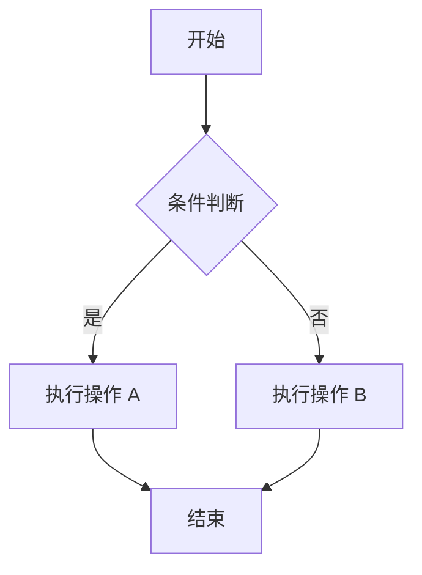

### 复杂流程图

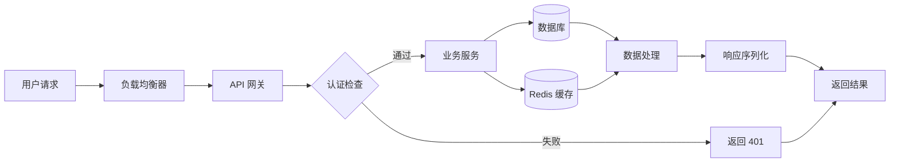

### 子图 (Subgraph)

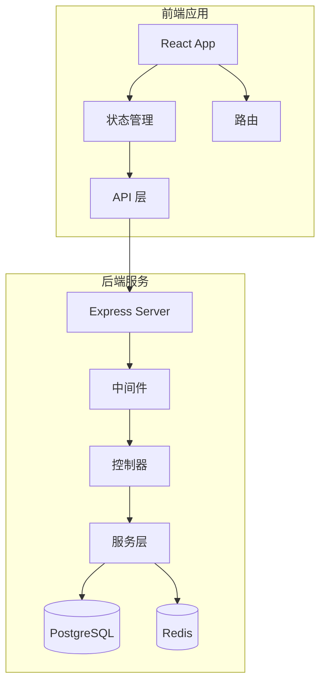

---

## 时序图 (Sequence Diagram)

### 基础时序图

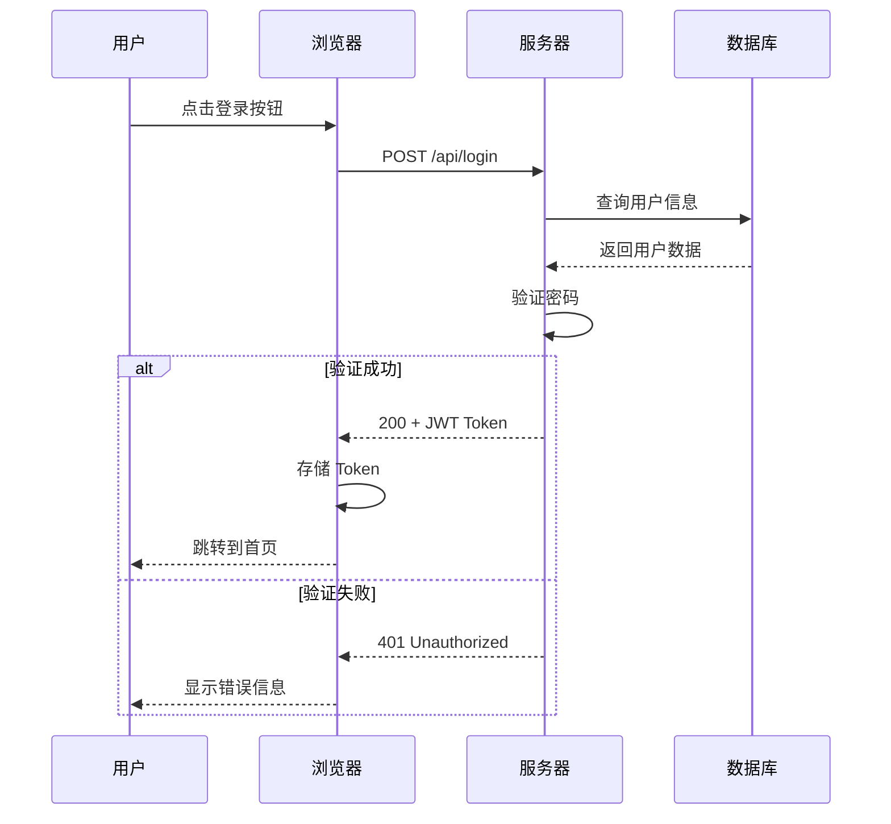

### 带注释和循环的时序图

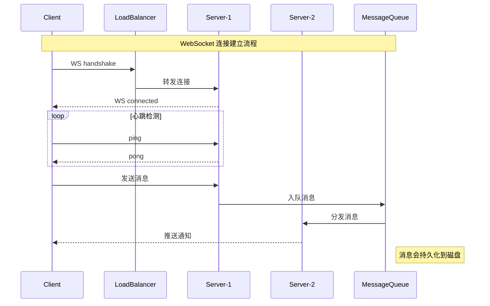

---

## 甘特图 (Gantt Chart)

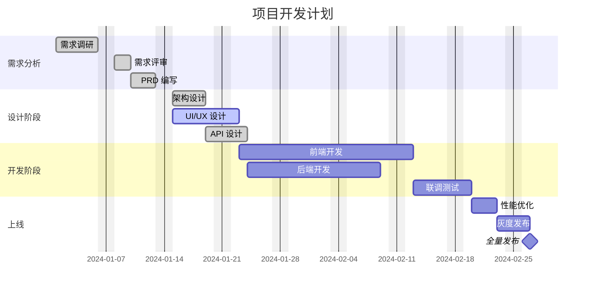

---

## 类图 (Class Diagram)

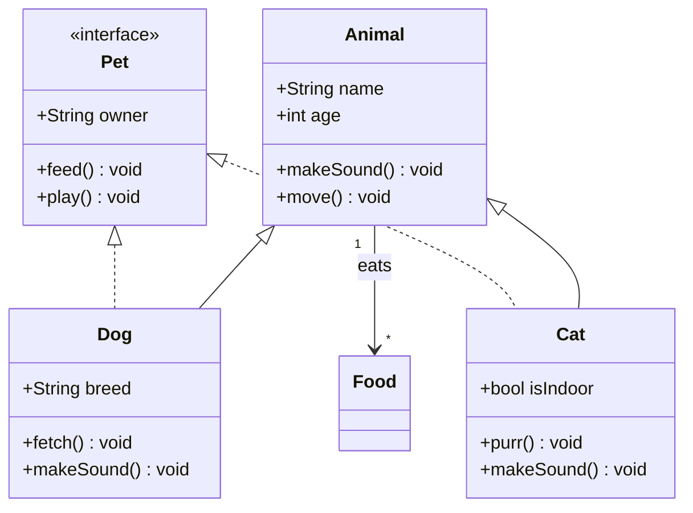

---

## 状态图 (State Diagram)

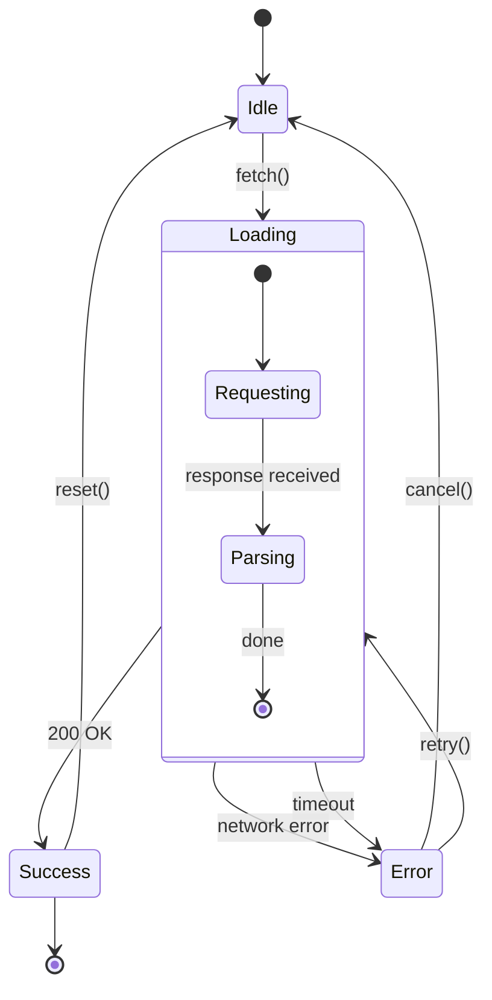

---

## ER 图 (Entity Relationship)

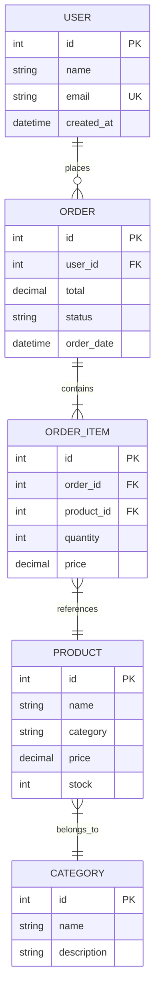

---

## 饼图 (Pie Chart)

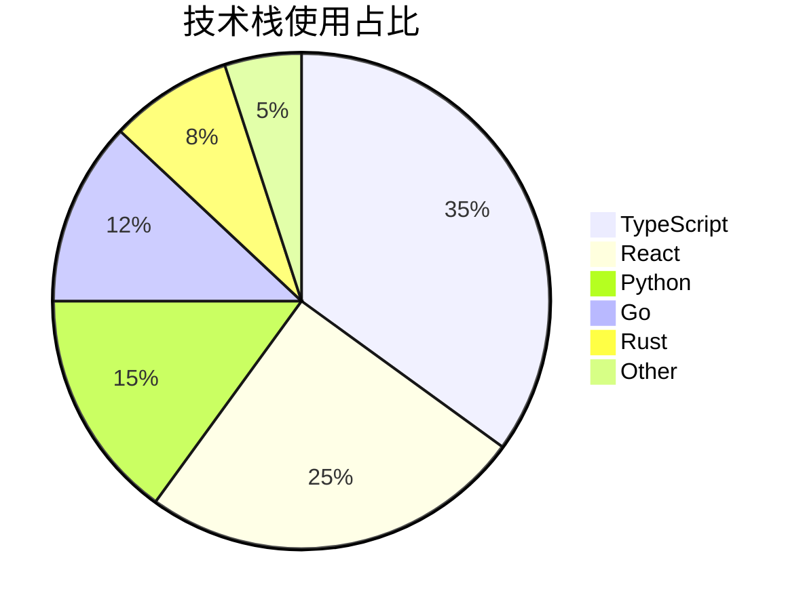

---

## Git Graph

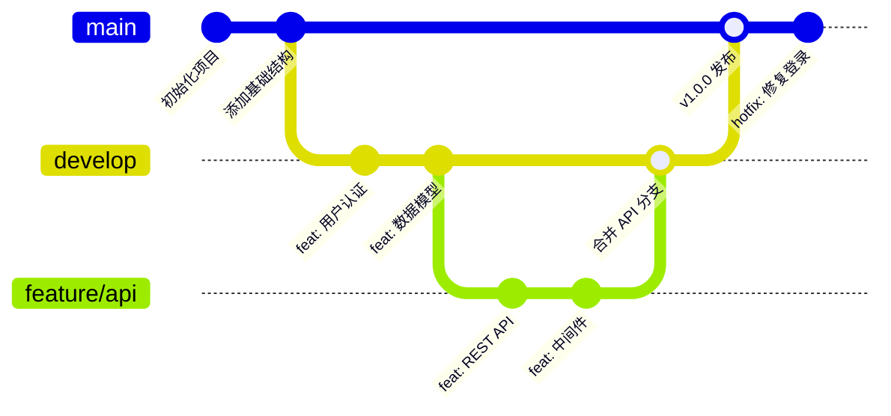

---

## 用户旅程图 (User Journey)

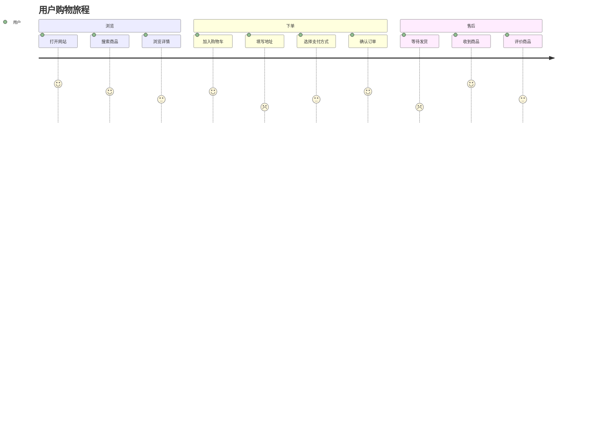

---

## 思维导图 (Mindmap)

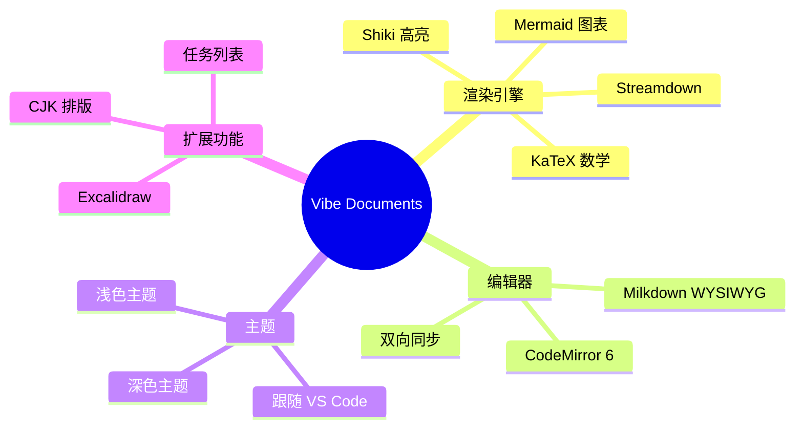

---

## 时间线 (Timeline)

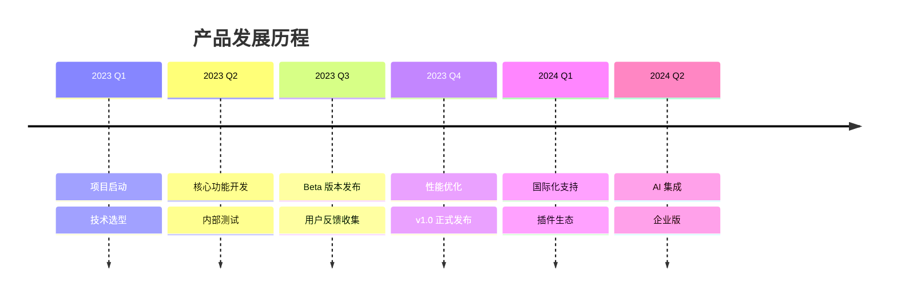
