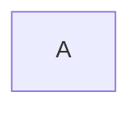
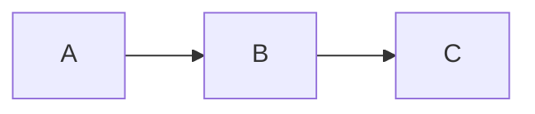

# 边界情况与压力测试

本文档覆盖各种边界情况和极端场景，用于测试插件的健壮性。

---

## 空内容区域

### 空的代码块

```
```

### 空的引用

>

### 仅包含空格的段落

   

---

## 超长内容

### 超长单行

ABCDEFGHIJKLMNOPQRSTUVWXYZ0123456789abcdefghijklmnopqrstuvwxyz0123456789ABCDEFGHIJKLMNOPQRSTUVWXYZ0123456789abcdefghijklmnopqrstuvwxyz0123456789ABCDEFGHIJKLMNOPQRSTUVWXYZ0123456789abcdefghijklmnopqrstuvwxyz0123456789ABCDEFGHIJKLMNOPQRSTUVWXYZ0123456789

### 超长代码行

```javascript
const veryLongVariableName = "This is an extremely long string that goes way beyond the normal width of the editor window to test horizontal scrolling behavior in code blocks within the Vibe Documents preview pane, and it just keeps going and going and going and going and going";
```

### 超长表格单元格

| 短 | 超级超级超级超级超级超级超级超级超级超级超级超级超级超级超级超级超级超级长的表格内容 |
|---|---|
| A | 这个单元格的内容非常非常非常非常非常非常非常非常非常非常非常非常非常非常非常非常非常非常非常非常非常长 |

### 超长 URL

[超长链接](https://www.example.com/very/long/path/that/goes/on/and/on/and/on/and/on/and/on/and/on/and/on/and/on/and/on/and/on/and/on/and/on/and/on/and/on/and/on/and/on/and/on?param1=value1&param2=value2&param3=value3&param4=value4&param5=value5)

---

## 深度嵌套

### 深度嵌套列表

- Level 1
  - Level 2
    - Level 3
      - Level 4
        - Level 5
          - Level 6
            - Level 7
              - Level 8

### 深度嵌套引用

> Level 1
> > Level 2
> > > Level 3
> > > > Level 4
> > > > > Level 5

---

## 特殊字符

### Unicode 字符

箭头：← → ↑ ↓ ↔ ↕ ⇐ ⇒ ⇑ ⇓

数学符号：∀ ∃ ∈ ∉ ⊂ ⊃ ∪ ∩ ∅ ∞ ≈ ≠ ≤ ≥

货币符号：$ € £ ¥ ₹ ₩ ₿

杂项符号：© ® ™ ° § ¶ † ‡ • ‣

方框绘图字符：╔═══╗ ║ ║ ╚═══╝

Emoji：😀 😎 🚀 💡 ⚡ 🔥 ✨ 🎉 👍 ❤️ 🌍 🎯

### 零宽字符

这里有一个零宽空格（U+200B）：「​」和一个零宽连接符（U+200D）：「‍」

### HTML 实体

&amp; → &
&lt; → <
&gt; → >
&quot; → "
&apos; → '
&copy; → ©
&reg; → ®

---

## 连续不同元素

以下测试各种元素紧密排列时的间距效果：

# 标题一
## 标题二
### 标题三

- 列表项

> 引用块

```js
code()
```

| A | B |
|---|---|
| 1 | 2 |

$$
E = mc^2
$$

---

## 代码语言边界测试

### 无语言标记的代码块

```
这是没有指定语言的代码块
function test() {
  return "plain text";
}
```

### 不常见语言

```toml
[package]
name = "my-project"
version = "0.1.0"
edition = "2021"

[dependencies]
tokio = { version = "1", features = ["full"] }
serde = { version = "1", features = ["derive"] }
```

```dockerfile
FROM node:20-alpine AS builder
WORKDIR /app
COPY package*.json ./
RUN npm ci --production
COPY . .
RUN npm run build

FROM node:20-alpine
WORKDIR /app
COPY --from=builder /app/dist ./dist
COPY --from=builder /app/node_modules ./node_modules
EXPOSE 3000
CMD ["node", "dist/server.js"]
```

```nginx
server {
    listen 80;
    server_name example.com;

    location / {
        proxy_pass http://localhost:3000;
        proxy_set_header Host $host;
        proxy_set_header X-Real-IP $remote_addr;
    }

    location /api {
        proxy_pass http://localhost:8080;
        proxy_read_timeout 300s;
    }
}
```

---

## Mermaid 边界测试

### 空 Mermaid 图



### 语法错误的 Mermaid

```mermaid
graph TD
    A --> B -->|invalid
    this is broken syntax
```

---

## 数学公式边界测试

### 空数学公式

$$

$$

### 行内公式在特殊位置

**加粗中的 $x^2$ 公式**

*斜体中的 $\alpha + \beta$ 公式*

`代码中的 $不应渲染$`

> 引用中的 $\sum_{i=1}^n i$ 公式

| 表格中 | $E = mc^2$ |
|--------|-----------|
| 数据 | $\pi \approx 3.14$ |

---

## 快速模式切换测试文本

以下内容用于测试在 Preview / WYSIWYG / Source 三种模式间快速切换时的稳定性：

This paragraph contains **bold**, *italic*, ~~strikethrough~~, and `inline code`. It also has a [link](https://example.com) and an inline formula $x = \frac{-b \pm \sqrt{b^2 - 4ac}}{2a}$.

```typescript
const answer = 42;
```



- [x] Task 1
- [ ] Task 2

| Key | Value |
|-----|-------|
| A | 1 |

> Quote text

---

## 连续水平线

---
---
---

## 空文档结尾（无换行）测试

以下是本文档的最后一行文本。