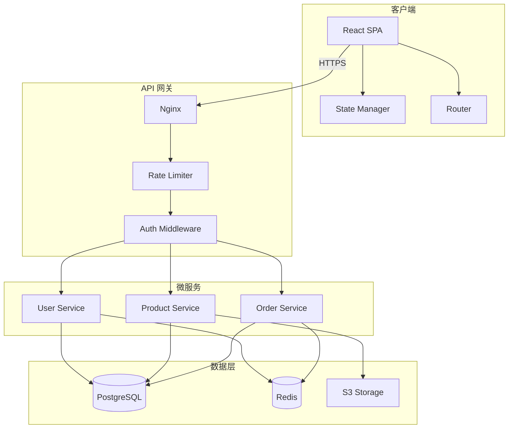
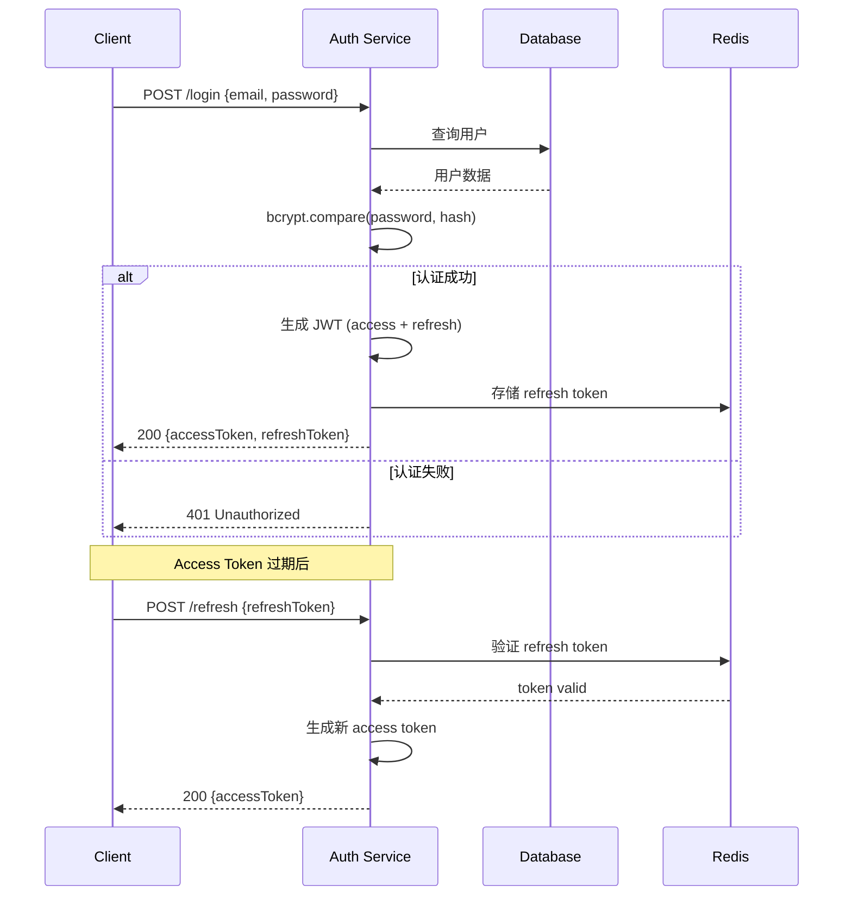
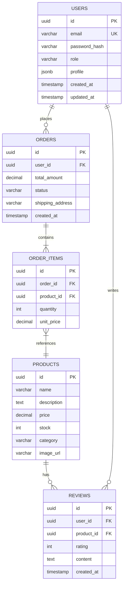
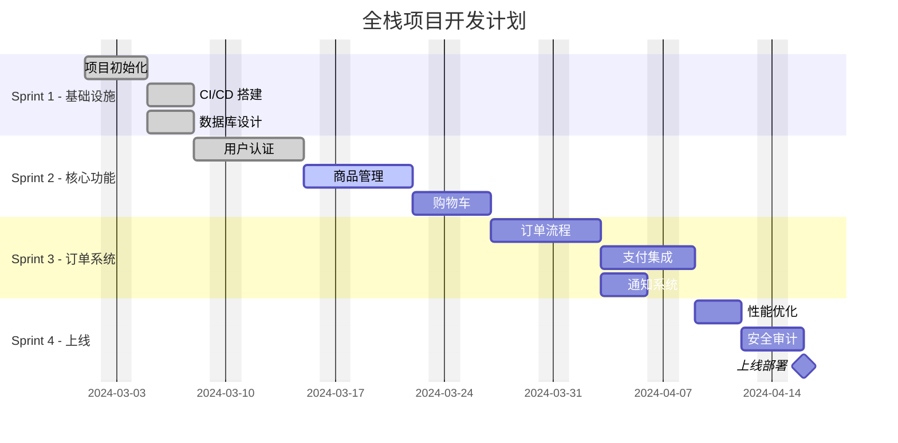

# 综合混合内容测试

本文档模拟真实使用场景，在单个文档中混合使用所有功能，测试它们之间的兼容性和排版效果。

***

## 项目概述：构建一个全栈 Web 应用1

### 技术选型     111111wqadwasas

我们将使用以下技术栈构建应用：

| 层级  | 技术                       | 说明          |
| --- | ------------------------ | ----------- |
| 前端  | React 19 + TypeScript111 | UI 组件和状态管理  |
| 样式  | Tailwind CSS 4           | 原子化 CSS 方案  |
| 后端  | Node.js + Express        | REST API 服务 |
| 数据库 | PostgreSQL               | 关系型数据库      |
| 缓存  | Redis                    | 会话和热点数据缓存   |
| 部署  | Docker + K8s             | 容器化部署       |

### 系统架构



***

## 用户认证模块

### JWT 认证流程



### 核心代码

用户模型定义：

```typescript
interface User {
  id: string;
  email: string;
  passwordHash: string;
  role: 'admin' | 'user' | 'guest';
  profile: {
    name: string;
    avatar?: string;
    bio?: string;
  };
  createdAt: Date;
  updatedAt: Date;
}

interface AuthTokens {
  accessToken: string;
  refreshToken: string;
  expiresIn: number;
}
```

认证服务实现：

```typescript
import bcrypt from 'bcrypt';
import jwt from 'jsonwebtoken';

class AuthService {
  private readonly JWT_SECRET = process.env.JWT_SECRET!;
  private readonly REFRESH_SECRET = process.env.REFRESH_SECRET!;

  async login(email: string, password: string): Promise<AuthTokens> {
    const user = await this.userRepo.findByEmail(email);
    if (!user) {
      throw new UnauthorizedError('Invalid credentials');
    }

    const isValid = await bcrypt.compare(password, user.passwordHash);
    if (!isValid) {
      throw new UnauthorizedError('Invalid credentials');
    }

    const accessToken = jwt.sign(
      { sub: user.id, role: user.role },
      this.JWT_SECRET,
      { expiresIn: '15m' }
    );

    const refreshToken = jwt.sign(
      { sub: user.id },
      this.REFRESH_SECRET,
      { expiresIn: '7d' }
    );

    await this.redis.set(`refresh:${user.id}`, refreshToken, 'EX', 7 * 24 * 3600);

    return { accessToken, refreshToken, expiresIn: 900 };
  }
}
```

> **安全提示**：生产环境中请确保：
>
> * 使用足够强度的密码哈希（bcrypt rounds >= 12）
>
> * JWT 密钥使用随机生成的 256 位密钥
>
> * Refresh Token 支持轮换（rotation）
>
> * 实现速率限制防止暴力破解

***

## 数据库设计

### ER 图



### 数据库迁移脚本

```sql
CREATE EXTENSION IF NOT EXISTS "uuid-ossp";

CREATE TABLE users (
    id UUID PRIMARY KEY DEFAULT uuid_generate_v4(),
    email VARCHAR(255) UNIQUE NOT NULL,
    password_hash VARCHAR(255) NOT NULL,
    role VARCHAR(20) DEFAULT 'user' CHECK (role IN ('admin', 'user', 'guest')),
    profile JSONB DEFAULT '{}',
    created_at TIMESTAMP WITH TIME ZONE DEFAULT NOW(),
    updated_at TIMESTAMP WITH TIME ZONE DEFAULT NOW()
);

CREATE INDEX idx_users_email ON users(email);
CREATE INDEX idx_users_role ON users(role);

CREATE TABLE products (
    id UUID PRIMARY KEY DEFAULT uuid_generate_v4(),
    name VARCHAR(255) NOT NULL,
    description TEXT,
    price DECIMAL(10, 2) NOT NULL CHECK (price >= 0),
    stock INTEGER NOT NULL DEFAULT 0 CHECK (stock >= 0),
    category VARCHAR(100),
    image_url VARCHAR(500),
    created_at TIMESTAMP WITH TIME ZONE DEFAULT NOW()
);

CREATE TABLE orders (
    id UUID PRIMARY KEY DEFAULT uuid_generate_v4(),
    user_id UUID NOT NULL REFERENCES users(id) ON DELETE CASCADE,
    total_amount DECIMAL(10, 2) NOT NULL,
    status VARCHAR(20) DEFAULT 'pending'
        CHECK (status IN ('pending', 'paid', 'shipped', 'delivered', 'cancelled')),
    shipping_address TEXT,
    created_at TIMESTAMP WITH TIME ZONE DEFAULT NOW()
);
```

***

## 性能优化

### 算法复杂度

在选择数据结构时，需要考虑以下时间复杂度：

| 操作 | Array  | LinkedList | HashMap | BST         |
| -- | ------ | ---------- | ------- | ----------- |
| 访问 | $O(1)$ | $O(n)$     | $O(1)$  | $O(\log n)$ |
| 搜索 | $O(n)$ | $O(n)$     | $O(1)$  | $O(\log n)$ |
| 插入 | $O(n)$ | $O(1)$     | $O(1)$  | $O(\log n)$ |
| 删除 | $O(n)$ | $O(1)$     | $O(1)$  | $O(\log n)$ |

其中哈希表的平均情况为 $O(1)$，最坏情况为 $O(n)$（哈希碰撞）。

### 缓存策略

LRU 缓存的命中率可以用以下公式估算：

$$
\text{Hit Rate} = 1 - \left(\frac{C}{N}\right)^{-\alpha}
$$

其中 $C$ 是缓存容量，$N$ 是数据集大小，$\alpha$ 是 Zipf 分布参数（通常 $\alpha \approx 0.8$）。

当请求分布满足 Pareto 原则（80/20法则）时，缓存效果最佳：

$$
P(X > x) = \left(\frac{x\_m}{x}\right)^\alpha, \quad x \geq x\_m
$$

***

## 项目进度

### 甘特图



### 任务清单

* [x] **Sprint 1** - 基础设施
  * [x] 项目脚手架搭建 (`create-turbo`)

  * [x] GitHub Actions CI/CD

  * [x] PostgreSQL + Redis Docker Compose

  * [x] Prisma Schema 设计

* [x] **Sprint 2** - 核心功能
  * [x] JWT 认证 + 刷新令牌

  * [ ] 商品 CRUD + 分页搜索

  * [ ] 购物车（Redis 存储）

* [ ] **Sprint 3** - 订单系统
  * [ ] 订单创建 + 状态机

  * [ ] Stripe 支付集成

  * [ ] 邮件通知

* [ ] **Sprint 4** - 上线准备
  * [ ] 负载测试（k6）

  * [ ] OWASP 安全检查

  * [ ] K8s 部署配置

***

## 部署配置

### Docker Compose

```yaml
services:
  app:
    build: .
    ports:
      - "3000:3000"
    environment:
      DATABASE_URL: postgresql://user:pass@db:5432/myapp
      REDIS_URL: redis://cache:6379
      JWT_SECRET: ${JWT_SECRET}
    depends_on:
      db:
        condition: service_healthy
      cache:
        condition: service_started

  db:
    image: postgres:16-alpine
    volumes:
      - pgdata:/var/lib/postgresql/data
    environment:
      POSTGRES_USER: user
      POSTGRES_PASSWORD: pass
      POSTGRES_DB: myapp
    healthcheck:
      test: ["CMD-SHELL", "pg_isready -U user -d myapp"]
      interval: 5s
      retries: 5

  cache:
    image: redis:7-alpine
    command: redis-server --maxmemory 256mb --maxmemory-policy allkeys-lru

volumes:
  pgdata:
```

***

## API 文档摘要

### 端点概览

| 方法     | 路径                   | 描述     | 认证      |
| ------ | -------------------- | ------ | ------- |
| `POST` | `/api/auth/login`    | 用户登录   | ❌       |
| `POST` | `/api/auth/register` | 用户注册   | ❌       |
| `POST` | `/api/auth/refresh`  | 刷新令牌   | ❌       |
| `GET`  | `/api/users/me`      | 获取当前用户 | ✅       |
| `PUT`  | `/api/users/me`      | 更新用户资料 | ✅       |
| `GET`  | `/api/products`      | 商品列表   | ❌       |
| `GET`  | `/api/products/:id`  | 商品详情   | ❌       |
| `POST` | `/api/products`      | 创建商品   | ✅ Admin |
| `POST` | `/api/orders`        | 创建订单   | ✅       |
| `GET`  | `/api/orders/:id`    | 订单详情   | ✅       |

### 响应格式

```json
{
  "success": true,
  "data": {
    "id": "550e8400-e29b-41d4-a716-446655440000",
    "email": "user@example.com",
    "profile": {
      "name": "张三",
      "avatar": "https://example.com/avatar.jpg"
    },
    "role": "user",
    "createdAt": "2024-03-01T08:00:00.000Z"
  },
  "meta": {
    "requestId": "req-abc123",
    "timestamp": "2024-03-15T10:30:00.000Z"
  }
}
```

### 错误处理

```json
{
  "success": false,
  "error": {
    "code": "VALIDATION_ERROR",
    "message": "请求参数验证失败",
    "details": [
      { "field": "email", "message": "邮箱格式不正确" },
      { "field": "password", "message": "密码长度不能少于8位" }
    ]
  }
}
```

***

## 总结

> 📝 **回顾要点**
>
> 1. 使用 JWT + Redis 实现无状态认证
> 2. PostgreSQL 作为主数据库，Redis 处理缓存和会话
> 3. Docker Compose 统一管理开发环境
> 4. 合理的时间复杂度选择决定了系统性能上限
> 5. 11
> 6. 22
>
>    <br />

本文档综合使用了以下 Markdown 功能：

* **文本格式**：加粗、斜体、行内代码

* **代码高亮**：TypeScript、SQL、YAML、JSON

* **Mermaid 图表**：架构图、时序图、ER 图、甘特图

* **KaTeX 数学**：行内公式、块级公式

* **表格**：数据表、对齐

* **列表**：任务列表、嵌套列表

* **引用块**：多层引用、带格式引用

