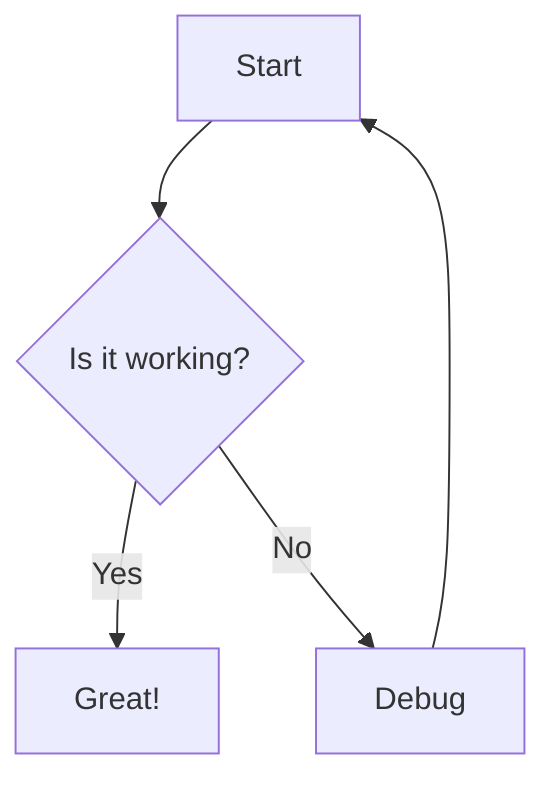
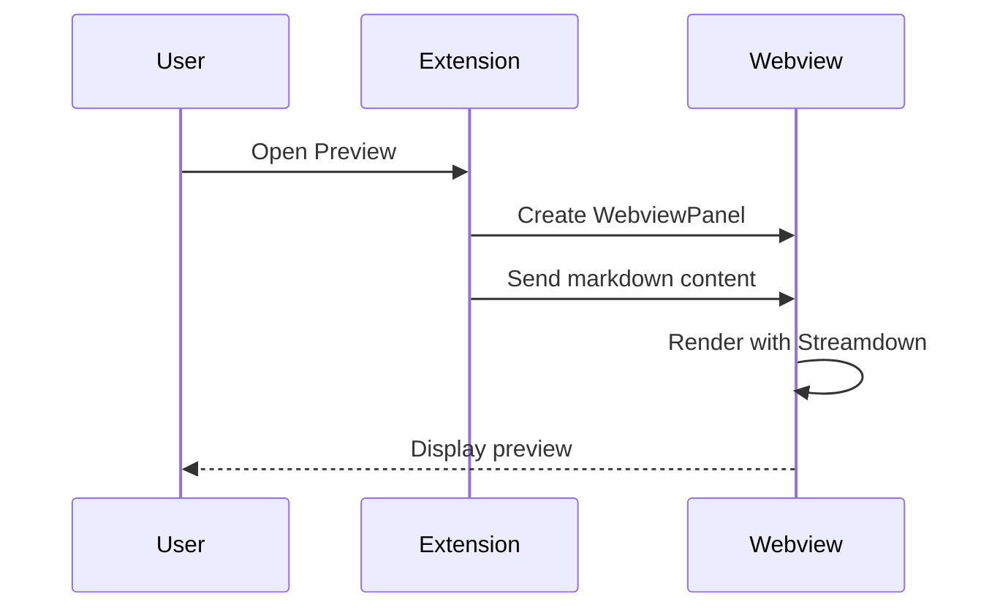

# Vibe Documents Demo

This is a demo file to test the **Cursor-style** Markdown preview.

## Code Highlighting

```typescript
interface User {
  id: number;
  name: string;
  email: string;
}

async function fetchUser(id: number): Promise<User> {
  const response = await fetch(`/api/users/${id}`);
  return response.json();
}
```

```python
def fibonacci(n: int) -> list[int]:
    """Generate Fibonacci sequence up to n numbers."""
    if n <= 0:
        return []
    fib = [0, 1]
    for i in range(2, n):
        fib.append(fib[i-1] + fib[i-2])
    return fib[:n]

print(fibonacci(10))
```

## Mermaid Diagrams





## Math Formulas

Inline math: $E = mc^2$

Block math:

$$
\int_{-\infty}^{\infty} e^{-x^2} dx = \sqrt{\pi}
$$

$$
\sum_{n=1}^{\infty} \frac{1}{n^2} = \frac{\pi^2}{6}
$$

## Tables

| Feature | Cursor | This Extension |
|---------|--------|----------------|
| Markdown rendering | ✅ | ✅ |
| Mermaid diagrams | ✅ | ✅ |
| Code highlighting | ✅ | ✅ |
| Math (KaTeX) | ✅ | ✅ |
| Theme sync | ✅ | ✅ |
| Image preview | ✅ | ✅ |

## Lists

### Ordered
1. First item
2. Second item
3. Third item with `inline code`

### Unordered
- Item one
- Item two
  - Nested item
  - Another nested item
- Item three

### Task List
- [x] Implement markdown rendering
- [x] Add mermaid support
- [x] Add code highlighting
- [ ] Test everything
- [ ] Publish extension

## Blockquote

> This is a blockquote with **bold** and *italic* text.
> 
> It can span multiple paragraphs.

## Horizontal Rule

---

## Links

Visit [VS Code Marketplace](https://marketplace.visualstudio.com/) for more extensions.

## Images


## Inline Formatting

This is **bold**, this is *italic*, this is ~~strikethrough~~, and this is `inline code`.

## Details

<details>
<summary>Click to expand</summary>

This content is hidden by default. It can contain **any** markdown content including:

```javascript
console.log("Hello from details!");
```

</details>
